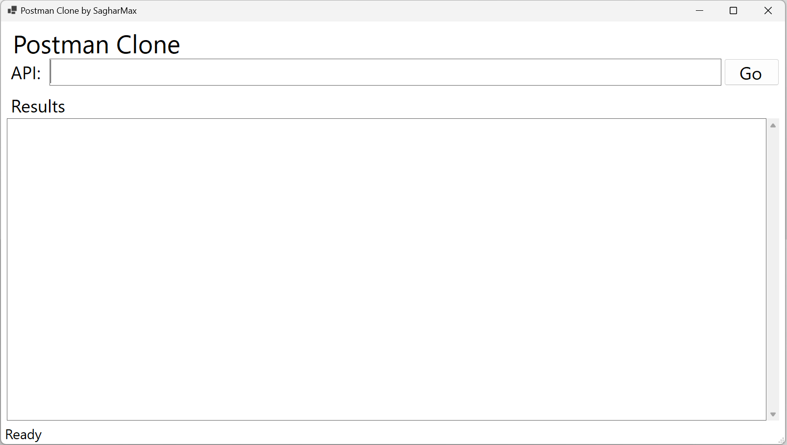
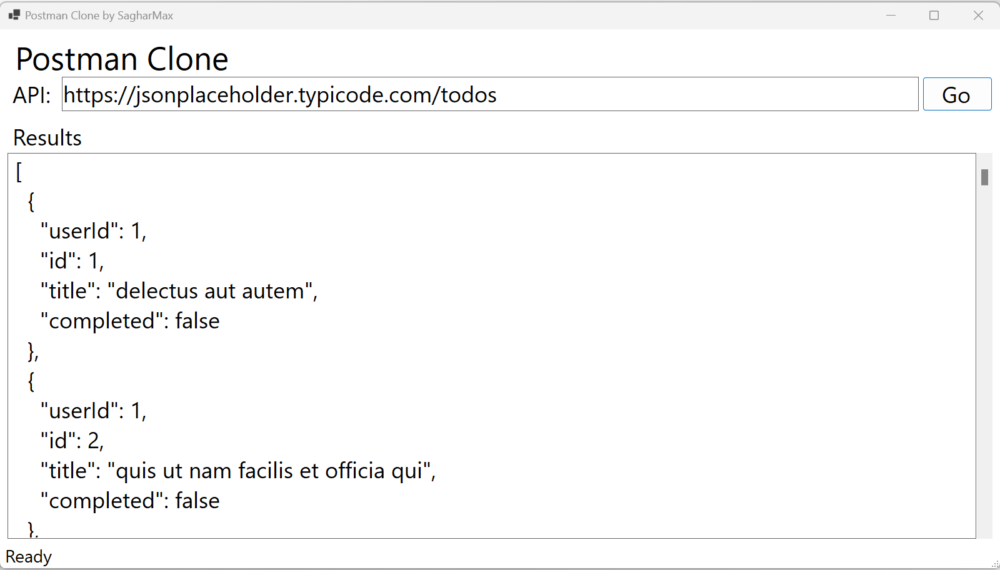

# Postman Clone
The Postman Clone offers a user-friendly interface for sending GET requests to APIs and displaying the responses in a well-formatted JSON. This tool streamlines API interaction and debugging, making it perfect for developers and testers. It enables you to validate and troubleshoot your API calls efficiently.

## Technologies Used
* C#
* .NET 8
* WinForms
* HttpClient

## Using The App
1. Download the executable file from the release section.
2. When the application launches, it should look like this:

3. Fill in your API URL and hit Go:

## Upcoming Changes
* Adding POST, PUT, PATCH, and DELETE functionality
* Adding API headers
* Heading API authentication
* Adding Dependency Injection
* Adding Loggings
* Create a web-based user interface for the application
